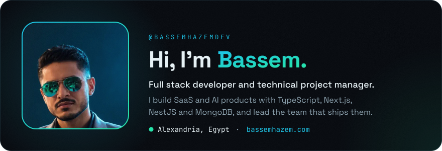
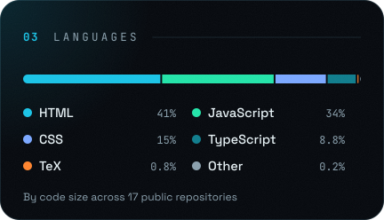
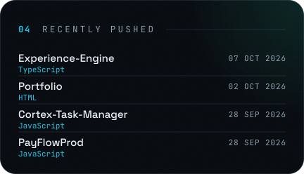
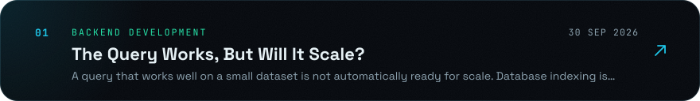
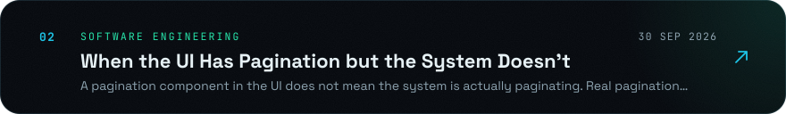
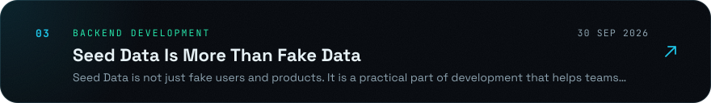

<!--
  Every image below is generated by scripts/ from the same content and theme as
  bassemhazem.com. To change something, edit scripts/data.mjs and run `npm run build`
  inside scripts/. The contributions, languages, repositories and articles refresh themselves
  (see .github/workflows/profile.yml).
-->

  
  
  
  
  

  
  

<!--ARTICLES:START-->

<!--ARTICLES:END-->
