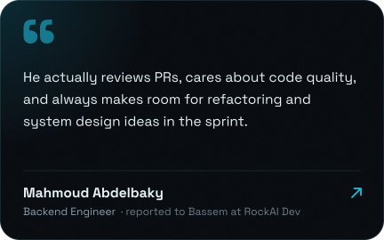
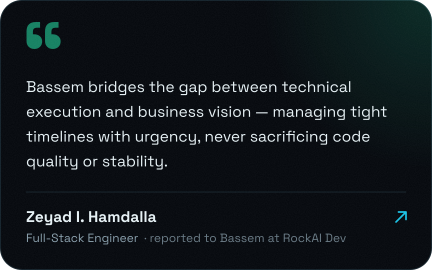

<!--
  Every image below is generated by scripts/ from the same content and theme as
  bassemhazem.com. To change something, edit scripts/data.mjs and run `npm run build`
  inside scripts/. The Writing and Contributions sections refresh themselves
  (see .github/workflows/profile.yml).
-->

  
  
  
  
  

  
  

  
  

Source: <a href="https://github.com/BassemHazemDev/PayFlowProd">PayFlow</a> · <a href="https://github.com/BassemHazemDev/Cortex-Task-Manager">Cortex</a>

<b>The full stack, as text</b>

 

| Area | Tools |
| --- | --- |
| **Frontend** | HTML5, CSS3, JavaScript (ES6+), TypeScript, React.js, Next.js, React Native, Tailwind CSS, Bootstrap, Vite |
| **Backend** | Node.js, Express.js, Nest.js, RESTful APIs, JWT Auth, API Design, Backend Architecture |
| **Databases** | MongoDB, MongoDB Atlas, MySQL, Database Design, Database Optimization |
| **AI & Integrations** | FastAPI, Qdrant, Gemini, RAG Pipelines, AI Assistants, AI Automation |
| **Tools & Infra** | Git, GitHub, Docker, Vercel, Redis, Cloudflare WAF, Jira, Notion |
| **Programming & CS** | JavaScript, TypeScript, Java, Python, Data Structures, Algorithms, OOP |

<!--ARTICLES:START-->

<!--ARTICLES:END-->

  
  

<b>Education and certifications</b>

 

**B.Sc. in Computer Science** · Alexandria University, Faculty of Science · Oct 2022 — Jun 2026 
GPA 3.88 / 4.00 · Ranked #1 in the Special Computer Science Department

| Certification | Issuer |
| --- | --- |
| Software Development — MERN (7-month track with Agile delivery) | Digital Egypt Pioneers Initiative |
| [Responsive Web Design](https://www.freecodecamp.org/certification/bassemhazem/responsive-web-design) | freeCodeCamp |
| [JavaScript Algorithms & Data Structures](https://www.freecodecamp.org/certification/bassemhazem/javascript-algorithms-and-data-structures-v8) | freeCodeCamp |
| Front End Development Libraries | freeCodeCamp |
| Quantum Computing & Programming (100% across quizzes, labs and final project) | QWorld · AIU · AleQCG |
| Foundations of Project Management | Google |
| Professional Diploma in Project Management | MTF Institute |
| [Train the Trainer](https://www.udemy.com/certificate/UC-03f248c1-5b51-424f-bf0c-921b9c0146ee/) | Udemy |

